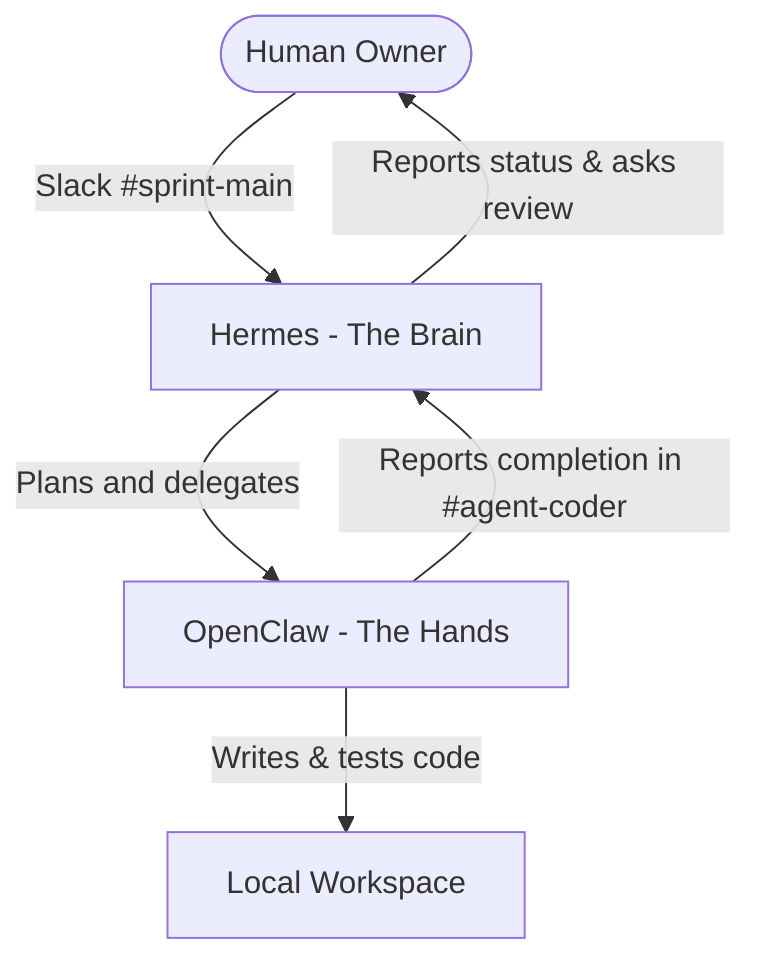

# System Architecture - ZenFlow Kanban

This document describes the double-agent system, the model routing scheme, and the technical layout of **ZenFlow Kanban**.

---

## Agent System Overview

We utilize a two-agent system where roles are split into high-level orchestration (the brain) and specific implementation tasks (the hands):

### 1. The Brain (Hermes Agent)
- **Role**: Plan milestones, manage memory, event-scheduling, and delegate coding blocks to OpenClaw.
- **Provider**: Google Gemini
- **Model**: `gemini-2.5-flash` (via AI Studio endpoint)
- **Rationale**: Large context window to hold board architecture in memory, low latency, and highly structured logical planning.

### 2. The Hands (OpenClaw)
- **Role**: Read/write code files, execute artisan and npm compile commands, verify linting, and deploy packages.
- **Provider**: Ollama (Local) / Groq
- **Model**: `qwen2.5-coder` (Ollama) / `llama-3.3-70b-versatile` (Groq)
- **Rationale**: fast execution, zero token-cost for heavy development loops, and superior coding syntax capabilities.

---

## Slack Channel Scheme

All agent communications are wired through a dedicated Slack workspace to keep actions transparent and auditable:

1. **`#sprint-main`**: Orchestration and Human interaction.
   - User posts goals (e.g., "Build React board view connected to Laravel API").
   - Hermes responds with a breakdown, prompts for permission to execute, and posts status reports.
2. **`#agent-coder`**: Workspace coding thread.
   - Hermes delegates tasks (e.g., "Scaffold migration tables for cards and sync relationships").
   - OpenClaw processes the code edits, runs verification tasks, and reports completed code segments.
3. **`#agent-log`**: Audit and monitoring feed.
   - Outputs raw tool executions, terminal commands, and event logs.

---

## Technical Stack & Decoupled Data Flow

### Backend
- **Laravel 12 (REST API)**: Exposes endpoints for Board, List, Card, Tag, and Member CRUD.
- **SQLite**: Local database.
- **Form Request Validation**: Prevents dirty state inputs.

### Frontend
- **React + Vite**: Interactive SPA.
- **Axios Client**: Communicates with the backend at `http://localhost:8000/api`.
- **CSS Variables & custom layout**: Glassmorphic layout designed with Indigo accents.
